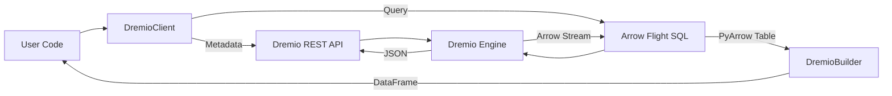

# Architecture

DremioFrame is designed to abstract the complexities of Dremio's REST API and Arrow Flight SQL interface into a user-friendly Python library.

## Components

### 1. DremioClient (`client.py`)
The main entry point. It manages authentication and holds references to the `Catalog` and `Builder` factories.
- **Authentication**: Supports PAT (Cloud/Software) and Username/Password (Software).
- **Factories**: Access to `catalog`, `admin`, `iceberg`, `udf`, `quality`, and `orchestration` modules.

### 2. Catalog (`catalog.py`)
Handles all metadata and administrative operations.
- **Entities**: Manages Sources, Spaces, Folders, Datasets, and Views.
- **Governance**: Manages Tags, Wiki content, and Grants.

### 3. DremioBuilder (`builder.py`)
Provides a fluent interface for constructing queries and performing operations.
- **Query Building**: `select`, `filter`, `mutate`, `group_by`, `agg`, `order_by`, `join`.
- **Data Ingestion**: `insert`, `merge`, `create` (CTAS), `create_view`.
- **Iceberg**: `at_snapshot`, `at_timestamp`, `optimize`, `vacuum`, `expire_snapshots`.
- **Visualization**: `chart` (matplotlib/plotly integration).
- **Export**: `to_csv`, `to_parquet`, `to_json`.

### 4. SQL Functions (`functions.py`)
A module (`F`) providing a comprehensive suite of SQL functions and Window API.
- **Expression Builder**: Chainable `Expr` objects.
- **Window Spec**: `Window.partition_by(...).order_by(...)`.
- **Categories**: Aggregates, Math, String, Date/Time, Conditional, Complex Types, AI Functions.

### 5. Administration (`admin.py`)
Handles administrative tasks via REST API.
- **User/Role Management**: Create, update, delete users and roles.
- **Privileges**: Grant/Revoke privileges on catalog entities.
- **Governance**: Manage Row Access Policies and Column Masking Policies.
- **Reflections**: Create, list, enable/disable reflections.
- **Sources**: Create and manage sources (including S3 helper).
- **Profiling**: Fetch and visualize job profiles.

### 6. AI Module (`ai/`)
- **Agent**: `DremioAgent` uses LangGraph to orchestrate AI tasks.
- **Tools**:
    - `list_documentation`, `read_documentation`: Access library docs.
    - `search_dremio_docs`, `read_dremio_doc`: Access Dremio docs.
    - `list_catalog_items`, `get_table_schema`: Access Dremio catalog metadata.
- **Capabilities**:
    - Script Generation: Generates Python scripts using `dremioframe`.
    - SQL Generation: Generates and validates SQL queries.
    - API Call Generation: Generates cURL commands for Dremio API.

### 7. Orchestration (`orchestration/`)
Lightweight DAG runner for data pipelines.
- **Pipeline**: Manages task execution and dependencies.
- **Tasks**:
    - `DremioQueryTask`, `DremioBuilderTask`: Execute SQL/Builder logic.
    - `OptimizeTask`, `VacuumTask`, `RefreshReflectionTask`: Maintenance tasks.
    - `DataQualityTask`: Run DQ checks.
    - `HttpTask`, `EmailTask`, `ShellTask`, `S3Task`: Utility tasks.
- **Sensors**: `SqlSensor`, `FileSensor`.
- **Backends**: State storage (`SQLiteBackend`, `PostgresBackend`, `MySQLBackend`).
- **Executors**: `LocalExecutor`, `CeleryExecutor`.
- **Scheduler**: `APScheduler` integration for cron/interval scheduling.
- **UI**: Vue.js-based web dashboard for monitoring pipelines.

### 8. Data Quality (`dq/`)
File-based data quality testing framework.
- **DQRunner**: Executes tests defined in YAML files.
- **Checks**: `not_null`, `unique`, `values_in`, `row_count`, `custom_sql`.
- **Integration**: Accessible via `dremio-cli dq run` or `DataQualityTask`.

### 9. CLI (`cli.py`)
Command-line interface built with `typer`.
- `query`: Run SQL queries.
- `catalog`: Browse catalog.
- `reflections`: Manage reflections.
- `pipeline`: Manage orchestration pipelines and UI.
- `dq`: Run data quality tests.
- `generate`: AI script generation.
- `generate-sql`: AI SQL generation.
- `generate-api`: AI API call generation.
- `repl`: Interactive Dremio shell.

### 10. AsyncDremioClient (`async_client.py`)
Asynchronous client using `aiohttp` for high-concurrency applications.
- Async context manager support.
- Non-blocking REST API calls.

### 11. LocalBuilder (`local_builder.py`)
Wraps DataFusion for local SQL execution on cached Arrow files.
- Mimics `DremioBuilder` API for local processing.

### 12. UDFManager (`udf.py`)
Manages SQL User Defined Functions.
- `create`, `drop`, `list`.

### 13. DremioIcebergClient (`iceberg.py`)
Wraps `pyiceberg` for direct catalog interaction.
- `list_namespaces`, `list_tables`, `load_table`, `create_table`.


## Data Flow

### System Overview


### Orchestration Flow
```mermaid
graph TD
    Scheduler[APScheduler] -->|Trigger| Pipeline[Pipeline]
    Pipeline -->|Submit| Task[Task]
    Task -->|Execute| Executor[Executor (Local/Celery)]
    Executor -->|Run| Action[Task Action]
    Action -->|Result| Backend[State Backend]
    Backend -->|Status Update| UI[Web UI]
```

1.  **User** instantiates `DremioClient`.
2.  **User** calls `client.catalog.list_catalog()` -> **REST API** -> JSON response.
3.  **User** calls `client.table("source.table")` -> Returns `DremioBuilder`.
4.  **User** chains methods `builder.filter(...)` -> Updates internal state.
5.  **User** calls `builder.collect()` -> Generates SQL -> **Arrow Flight** -> Arrow Table -> Dataframe.

## Testing Strategy

Tests are categorized by dependency:
1.  **Unit/Cloud**: Core logic + Dremio Cloud integration.
2.  **Software**: Dremio Software specific.
3.  **Backends**: External DBs (Postgres/MySQL).

See [Testing Guide](docs/testing.md) for details.
