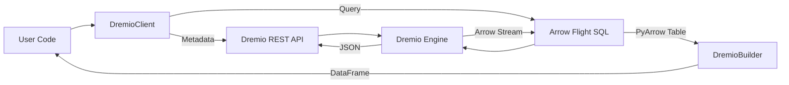

# Architecture

DremioFrame is designed to abstract the complexities of Dremio's REST API and Arrow Flight SQL interface into a user-friendly Python library.

## Components

### 1. DremioClient (`client.py`)
The main entry point. It manages authentication and holds references to the `Catalog` and `Builder` factories.

### 2. Catalog (`catalog.py`)
Handles all metadata and administrative operations- **Catalog**: Manages Dremio catalog entities (sources, spaces, folders, datasets). Supports creating/updating views, managing tags, wiki content, data lineage, and access grants.
- Create/Update/Delete sources and views.

### 3. DremioBuilder (`builder.py`)
Provides a fluent interface for constructing queries.
- **DremioBuilder**: A fluent query builder that generates SQL.
    - `select()`, `filter()`, `mutate()`: Basic operations.
    - `group_by()`, `agg()`: Aggregation.
    - `order_by()`, `distinct()`: Sorting and deduplication.
    - `join()`: Joining tables.
    - `insert()`, `merge()`, `create()`: Data ingestion, upsert, and CTAS.
    - `at_snapshot()`, `at_timestamp()`: Iceberg Time Travel.
    - `optimize()`, `vacuum()`: Iceberg Maintenance.
    - `chart()`, `to_csv()`, `to_parquet()`: Visualization and Export.
    - `quality`: Access to `DataQuality` checks.
- **Functions (`functions.py`)**: A module (`F`) providing SQL functions and Window API.
    - `Expr`: Chainable SQL expressions.
    - `Window`: Window specification builder.
    - Standard functions: Aggregates, Math, String, Date, Conditional.
### 4. DataQuality (`quality.py`)
Provides methods to run validation queries against the data defined by the builder.
- `expect_not_null`, `expect_unique`, `expect_values_in`, `expect_row_count`.

### 5. Admin (`admin.py`)
Handles administrative tasks via REST API.
- User/Role management.
- Grant/Revoke privileges.
- Policy management (Row Access, Masking).
- **Governance**: Manage UDFs, Row Access Policies, and Column Masking Policies.

### AI Module (`dremioframe/ai`)
- **Agent**: `DremioAgent` uses LangGraph to orchestrate AI tasks.
- **Tools**:
    - `list_documentation`, `read_documentation`: Access library docs.
    - `search_dremio_docs`, `read_dremio_doc`: Access Dremio docs.
    - `list_catalog_items`, `get_table_schema`: Access Dremio catalog metadata.
- **Capabilities**:
    - Script Generation: Generates Python scripts using `dremioframe`.
    - SQL Generation: Generates and validates SQL queries.
    - API Call Generation: Generates cURL commands for Dremio API.

### 7. AsyncDremioClient (`async_client.py`)
Asynchronous client using `aiohttp` for high-concurrency applications.
- Async context manager support.
- Non-blocking REST API calls (Catalog, SQL execution).

### 7. CLI (`cli.py`)
Command-line interface built with `typer`.
- `dremio-cli query`: Run SQL queries.
- `dremio-cli catalog`: Browse catalog.
- `dremio-cli reflections`: Manage reflections.

### 8. LocalBuilder (`local_builder.py`)
Wraps DataFusion for local SQL execution on cached Arrow files.
- Mimics `DremioBuilder` API (`select`, `filter`, `group_by`, `agg`, `sql`).

### 9. UDFManager (`udf.py`)
Manages SQL User Defined Functions.
- `create`, `drop`, `list`.

### 10. QueryProfile (`profile.py`)
Parses and visualizes job profiles.
- `summary`, `visualize`.

### 11. DremioIcebergClient (`iceberg.py`)
Wraps `pyiceberg` for direct catalog interaction.
- `list_namespaces`, `list_tables`, `load_table`, `create_table`.

### 12. Utils (`utils.py`)
Helper functions for configuration, logging, and common transformations.

### 13. Orchestration (`orchestration/`)
Lightweight DAG runner for data pipelines.
- **Orchestration**: `dremioframe.orchestration`
  - **Pipeline**: Manages task execution and dependencies.
  - **Tasks**: Units of work (`DremioQueryTask`, `DremioBuilderTask`, `DbtTask`, `DataQualityTask`, etc.).
  - **Sensors**: Wait for conditions (`SqlSensor`, `FileSensor`).
  - **Backends**: State storage (`SQLiteBackend`, `PostgresBackend`, etc.).
  - **Executors**: Task execution strategies (`LocalExecutor`, `CeleryExecutor`).
- **CLI**: `dremioframe.cli` (Typer-based CLI with Interactive REPL).
- **Data Quality**: `dremioframe.dq` (YAML-based DQ framework).
- **Pydantic**: Integration for schema validation and DDL generation.
- **Scheduler**: Robust scheduling via `APScheduler` (Interval, Cron, Persistent Job Stores).
- **UI**: Vue.js-based web dashboard with Basic Auth security.
- **Specialized Tasks**: `DremioQueryTask`, `OptimizeTask`, `VacuumTask`, `RefreshReflectionTask`, `DataQualityTask`.
- **General Tasks**: `HttpTask`, `EmailTask`, `ShellTask`, `S3Task`.
- **Deployment**: Docker support (`Dockerfile`, `docker-compose.yml`).

### 14. Data Quality Framework (`dq/`)
File-based data quality testing framework.
- **DQRunner**: Executes tests defined in YAML files.
- **Checks**: `not_null`, `unique`, `values_in`, `row_count`, `custom_sql`.
- **CLI**: `dremio-cli dq run` command.


## Data Flow

### System Overview


### Orchestration Flow
```mermaid
graph TD
    Scheduler[APScheduler] -->|Trigger| Pipeline[Pipeline]
    Pipeline -->|Submit| Task[Task]
    Task -->|Execute| Executor[Executor (Local/Celery)]
    Executor -->|Run| Action[Task Action]
    Action -->|Result| Backend[State Backend]
    Backend -->|Status Update| UI[Web UI]
```

1.  **User** instantiates `DremioClient`.
2.  **User** calls `client.catalog.list_catalog()` -> **REST API** -> JSON response.
3.  **User** calls `client.table("source.table")` -> Returns `DremioBuilder`.
4.  **User** chains methods `builder.filter(...)` -> Updates internal state.
5.  **User** calls `builder.collect()` -> Generates SQL -> **Arrow Flight** -> Arrow Table -> Dataframe.

## Testing Strategy

Tests are categorized by dependency:
1.  **Unit/Cloud**: Core logic + Dremio Cloud integration.
2.  **Software**: Dremio Software specific.
3.  **Backends**: External DBs (Postgres/MySQL).

See [Testing Guide](docs/testing.md) for details.
